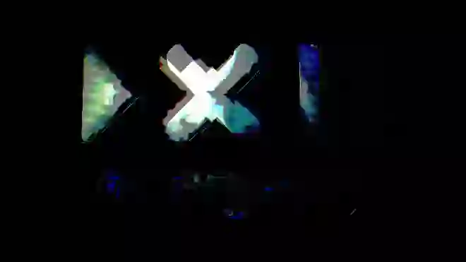

<h1>2021 - A new beginning</h1>

<!-- TOC -->

- [2020 Goals recap](#2020-goals-recap)
    - [Understand me](#understand-me)
    - [Improve health](#improve-health)
    - [Family vacation](#family-vacation)
    - [Get in contact with my family](#get-in-contact-with-my-family)
    - [Writing habit](#writing-habit)
    - [Sell 10 Konekti subscriptions](#sell-10-konekti-subscriptions)
    - [Read 1 x book](#read-1-x-book)
    - [Write 1 x song](#write-1-x-song)
    - [Explore Machine Learning](#explore-machine-learning)
    - [First steps with a robot](#first-steps-with-a-robot)
    - [Use modV 3.0](#use-modv-30)
    - [Become a better VJ](#become-a-better-vj)
    - [Run the "Visual and Light Workshop" at least 2 times](#run-the-visual-and-light-workshop-at-least-2-times)
- [2020 overall recap](#2020-overall-recap)
- [First schickmalzwo session since 6 months](#first-schickmalzwo-session-since-6-months)
- [#anydayshaders with ISF Editor](#anydayshaders-with-isf-editor)
- [RainbowGridWave](#rainbowgridwave)
    - [Video 1](#video-1)
    - [Video 2](#video-2)
    - [Video 3](#video-3)
    - [Video 4](#video-4)
    - [Video 5](#video-5)
- [schickmalzwo & Mc Proper on Twitch](#schickmalzwo--mc-proper-on-twitch)

<!-- /TOC -->

---

⏤⏤⏤⏤⏤⏤⏤⏤⏤⏤⌶⏤⏤⏤⏤⏤⏤⏤⏤⏤⏤

---

## 2020 Goals recap

*2021-01-27*

I can't believe that [2020](2020.md) was what it was when I started to write the things I want to accomplish. As it turned out, the title *"Get my shit together"* (<cite>[2020](2020.md)</cite>) was very accurate, even more than I would have imagined. Who am I kidding, it was fucking beyond my own universe. But let's see the results of my [2020 goals](2020.md#goals-in-2020):

### Understand me

In December 2020 I had the first interaction with a Psychologist, which was a huge step for me. I'm waiting for the first "get to know each other" session, but my hopes are low to actually get a therapy based on this, as the waiting list is very long. But as I started, will continue.

### Improve health

* A few months in 2020 of not eating meat, but then I started again to eat meat regularly. Most of the time I ate local meat from a butcher in a very high quality, but I also had times where I ate fast-food-quality meat. This will change this year for sure
* I reduced the consumption of alcohol to a super minimum, this can be even more improved
* Until July I was still smoking weed regularly, but I stopped since 02. July 2020
* I still ate a lot of white sugar, mostly sweets. This is something I'm in the process of stopping since 23rd of January 2021
* I smoked almost no tobacco, but the few times I did where not worth it at all. I just need to stop doing this 100%
* I did two yoga positions almost every day, but I never got really into it to get "further". My lower back is still not 100% pain free
* Meditation was something I didn't integrate at all. I'm actually not sure why, I guess I'm just too lazy
* I tried to use some memory techniques to exercise my brain, but didn't start to walk this path
* I slept a lot more, even when there were a lot of nights without a good quality of sleep, but those were related to my daughter sleeping next to me and she was not sleeping very well until late of 2020. Then I tried CBD to calm her down at night and this was improving my sleep drastically as she is sleeping super well

### Family vacation

We were not really able to do any family vacation. First reason is that FaPi and I are not in a romantic relationship anymore, which shifted our focus a lot. And the other reason was Covid-19, which forced us to cancel all vacation plans. We spend a lot of time together in the house and in our garden, but it was no vacation where we actually where at a different place. But that was not a bad thing at all. 

### Get in contact with my family

I couldn't manage this at all. I want to try this again this year. Get in contact with my aunt and grandmother. More contact with my parents. Any kind of contact with my brother. 

### Writing habit

The only thing I wrote was the list of goals for 2020, nothing more. This will stop with this new format. 

### Sell 10 Konekti subscriptions

We were not ableo to sell 10 Konekti subscriptions, but we were able to set the right direction for Synoa and for our product Konekti. I stronlgy believe that 2021 will be our year.

### Read 1 x book

Instead of finishing the book "Neuromancer by William Gibson" in time (I didn't even finish 1/3 of the book), I spend most my vacation to play the game "Cyberpunk 2077". The book is awesome, I just didn't invest time to actually finish it. Instead I was playing a lot of "Heros of the Storm" on my computer, even after I stopped smoking weed. This will also change this year. I want to finish the book. 

### Write 1 x song

I wasn't able to create a song in 2020, I only started to look into [rust-loop-drop](https://github.com/mmckegg/rust-loop-drop) almost exactly 1 year after I wrote "[How to get started?](https://github.com/mmckegg/rust-loop-drop/issues/2)". But this year I will create at least one song that I enjoy, it might not be with [rust-loop-drop](https://github.com/mmckegg/rust-loop-drop). 

### Explore Machine Learning

I attended one workshop at [CODAME "Make Art with Machine Learning"](https://codame.com/events/make-art-with-machine-learning) in which I learned some basics on the topic, but I didn't dive deeper. I also bought the book "Practical Machine Learning in JavasSript" and I want to read it this year to get more into the topic. 

### First steps with a robot

Didn't use my robots, will use them once my children are more chill with things. I guess then this will be super fun. 

### Use modV 3.0

In December 2020 I was able to finally switch to modV 3.0 (every other gig in 2020 was still using modV 2.0). But this was last minute, as only the very last gig (the New Years Eve Party together with 2xAA) was using modV 3.0. But I made it and I'm very happy. 

Sam Wray and myself also made it a habbit to have a fixed modV pair-programming session every tuesday evening, to further improve and build modV. My dedication for modV is more strong than ever and I want to invest a lot of time to make it as perfect as it can be. 

### Become a better VJ

* I did a few sessions with Jan Krutisch via YouTube and this was always super fun as we had a different topic each time. This was forcing me to take a look at new visuals with each gig and improve my modV set all the time. Having a regular session was also improving my connection to Jan's music and I have now a pretty good idea on how he is playing and what I need to do in order to make it look good from a visual point of view. I'm very happy about this
* In the first months of 2020 we had some gigs together with [schickmalzwo](https://schickmalzwo.de/) and a lot of gigs planned for [LiveJS](https://livejs.network/), but due to Covid-19 everything was cancelled. All the other gigs I had were some kind of live streams and one secret festival in the summer (where I did visuals and lights) + secret birthday bash
* I did a few workshops related to shader programming and because of the collaboration with Jan Krutisch, Sam Wray, Stone Creek Crew & Banana Bass Music I forced my self to create new content based on shaders from Lea Rosema and stuff from Shadertoy. By the end of 2020 I had a very good understanding on how the GLSL code works and which parts I need to change to make it parameterized to be used in modV 
* I also started to create a [few shaders myself](https://www.shadertoy.com/user/TimPietrusky) (most of them are private :D)

### Run the "Visual and Light Workshop" at least 2 times

Thanks to Covid-19 all our plans to do the workshop in combination with gigs with LiveJS were doomed. The last possibility Sam Wray and myself had was to do a workshop for CODAME's JOYNT Festival 2020. We had the honor to be selected for the festival and created a [workshop dedicated to modV 3](https://github.com/vcync/modV-Workshop). The workshop was super cool, about 15 people came. We had a major problem during the workshop (some users were not able to use audio-routing inside of modV because of permission problems in macOS). We were not able to fix this during the workshop, but the next day we found the problem (permissions in Electron). But overall the workshop was super nice and we loved doing it. 

---

So yeah that's it for the recap, I'm not sure if I should create a list of goals for this year? But let's see what my next log entry will bring...

---

⏤⏤⏤⏤⏤⏤⏤⏤⏤⏤⌶⏤⏤⏤⏤⏤⏤⏤⏤⏤⏤

---

## 2020 overall recap

*2021-02-04*

Besides the goals of 2020 I had a major "theme" (if you want to call it like this: "Get my shit together". I had no idea HOW hard this kicked in, but here comes a short summary:

* Late April 2020 I received the diagnosis that my 3 year old daughter NiPi has a rare DNA mutation called STXBP1 (If you want to know more you can listen to "[half/byte & NERDDISCO - STXBP1](https://www.youtube.com/watch?v=0wzqwHvKTAk&feature=youtu.be)")
* 2020-07-02: I stopped smoking weed
* 2020-07-28: The romantic relationship with FaPi (the woman I'm married too, with whom I have 2 kids and a house) ended. At first this was hard and I had support by very close friends (most thanks goes to my crew in Mainz for helping me super much!!!) to overcome my initial sadness and to see the good parts

The end of my romantic relationships means multiple things:

* I still live together with FaPi and my children in our house. We just work together as a team (as we did before anyway) and are a family
* We are not having any romantic things between us anymore (this was reduced to a super minimum anyway as we both have very different needs that the other person can't fulfill)
* FaPi has a new partner already (as we lived in an open relationship for 5 years )

---

⏤⏤⏤⏤⏤⏤⏤⏤⏤⏤⌶⏤⏤⏤⏤⏤⏤⏤⏤⏤⏤

---

## First schickmalzwo session since 6 months

*2021-02-06*

Last year we were not able to setup any online version of our schickmalzwo sessions, as we were lacking any audio streaming server. On 2021-02-05 I finally managed to sit down and create such a server for us, so that we can practise again. Here are the details:

* Cloud-Server from [Hetzner](https://www.hetzner.com) (2 vCPU, 4 GB RAM, Ubuntu)
* [Icecast](https://icecast.org/) 2.4.4 as the audio streaming server
* [Butt](https://danielnoethen.de/butt/) as the audio client
* [VB-Cable](https://vb-audio.com/Cable/) as a virtual audio interface to route the audio from [Traktor](https://www.native-instruments.com/en/catalog/traktor/dj-software/) to Butt

In the end it took us 1,5 h to set everything up, so around 22:30 on 2021-02-06 we had a 1 hour session. This was super nice and we can use this setup in the future. Hopefully next time with live streaming on [twitch.tv/NERDDISCO](https://twitch.tv/NERDDISCO).

---

⏤⏤⏤⏤⏤⏤⏤⏤⏤⏤⌶⏤⏤⏤⏤⏤⏤⏤⏤⏤⏤

---

## #anydayshaders with ISF Editor

*2021-02-13*

Last year I stared to write some shaders on shadertoy and then copied them over to editor.isf.video in order to parameterize them, but this year I will create all my shaders in the ISF Editor from the start. As I have no idea about the community on isf.video, I also want to share my shaders using #anydayshaders (thanks to ilityha for creating this ❤️), so my process will look something like this:

* Create the ISF shader in the ISF Editor
* Copy the ISF code into modV 
* Put the output window of modV at a resolution of 1920 x 1080 on a second screen
* Use OBS on the other screen and record the full resolution with a length of 59 seconds

---

⏤⏤⏤⏤⏤⏤⏤⏤⏤⏤⌶⏤⏤⏤⏤⏤⏤⏤⏤⏤⏤

---

## RainbowGridWave

*2021-02-14*

Inspired by ilithya & Eliza after watching their [curisouslyminded session 3](https://www.youtube.com/watch?v=yLX5P6zYx_U) I wanted to use `mod` in GLSL to create some kind of grid in combination with noise. My resulting #anydayshaders is called RainbowGridWave and you can change all its parameters using the ISF Editor: https://editor.isf.video/shaders/602831b6df59c70014cdc55f

### Video 1

| Property               | Value |
| ---------------------- | ----- |
| gridAmount             | 15    |
| gridAmountX            | 1     |
| gridAmountY            | 1     |
| gridWaveAutomatic      | true  |
| gridWaveFrequency      | -     |
| gridWaveFrequencySpeed | 0.5   |
| gridWaveExtrem         | false |

### Video 2

| Property               | Value |
| ---------------------- | ----- |
| gridAmount             | 30    |
| gridAmountX            | 1     |
| gridAmountY            | 1     |
| gridWaveAutomatic      | true  |
| gridWaveFrequency      | -     |
| gridWaveFrequencySpeed | 0.43  |
| gridWaveExtrem         | true  |

### Video 3

| Property               | Value |
| ---------------------- | ----- |
| gridAmount             | 13.16    |
| gridAmountX            | 2.6     |
| gridAmountX            | 1     |
| gridWaveAutomatic      | true  |
| gridWaveFrequency      | -     |
| gridWaveFrequencySpeed | 0.19  |
| gridWaveExtrem         | false  |

### Video 4

| Property               | Value |
| ---------------------- | ----- |
| gridAmount             | 21.38    |
| gridAmountX            | 2.6     |
| gridAmountX            | 7.3     |
| gridWaveAutomatic      | true  |
| gridWaveFrequency      | -     |
| gridWaveFrequencySpeed | -1.16  |
| gridWaveExtrem         | true  |

### Video 5

I would like to get the same effect as you see in the first column, but on the whole screen. So I think my next shader will be using these parameters as a starting point. 

| Property               | Value |
| ---------------------- | ----- |
| gridAmount             | 9.63    |
| gridAmountX            | 64.8     |
| gridAmountX            | 4.9     |
| gridWaveAutomatic      | true  |
| gridWaveFrequency      | -     |
| gridWaveFrequencySpeed | -0.45  |
| gridWaveExtrem         | true  |

---

⏤⏤⏤⏤⏤⏤⏤⏤⏤⏤⌶⏤⏤⏤⏤⏤⏤⏤⏤⏤⏤

---

## schickmalzwo & Mc Proper on Twitch

*2021-02-21*

Exactly one year ago schickmalzwo hosted the dnb floor of an art event called [Hybris](https://www.pengland.de/2020/02/hybris/), which took place in the old building (altes Jobcenter, Rodelberg) of [Peng](https://www.pengland.de/) in Mainz, Germany. We had a massive line up and the party was amazing. Then Covid-19 kicked in and we had to cancel all further parties in Peng and in general. 

In order to think about this awesome party and show everyone that the lockdown is already ongoing for one year, we wanted to have another dnb party close to this date. This is why schickmalzwo had a live stream yesterday night from 9 pm until 11 pm in collaboration with [Mc Proper](https://www.facebook.com/proper.mc). As the lockdown is still ongoing, we had to come up with a setup to make all of this work. 

The base setup (as we already tested this with the last schickmalzwo-session):

* Cloud-Server from [Hetzner](https://www.hetzner.com) (2 vCPU, 4 GB RAM, Ubuntu)
* [Icecast](https://icecast.org/) 2.4.4 as the audio streaming server
* [Butt](https://danielnoethen.de/butt/) as the audio client
* [VB-Cable](https://vb-audio.com/Cable/) as a virtual audio interface to route the audio from [Traktor](https://www.native-instruments.com/en/catalog/traktor/dj-software/) to Butt

The difference now is that we also had to include Mc Proper:

* PaTa was streaming the DJ set from his location to the Icecast-Server using butt into the **schickmalzwo** mount point
* Mc Proper was consuming the audio-stream from **schickmalzwo** using VLC, added his microphone to the mix using *Native Instruments Audio 8* + [VoiceMeter](https://vb-audio.com/Voicemeeter/index.htm) and then was streaming to the Icecast-Server using butt into the **mcproper** mount point
* I was consuming the audio-stream from **mcproper** using [WinAmp](https://www.winamp.com/) (enhanced with the plugin [LoudMax](https://loudmax.blogspot.com/))

With this basic setup, we were able to get the music in sync with the Mc and then with the visuals as the final result was streamed from my computer to [twitch.tv/schickmalzwo](https://twitch.tv/schickmalzwo). My desktop looked like this in the end:

* [modV](https://modv.vcync.gl/) was used to generate the visuals. I found a super nice [open-source visuals pack a few days ago](https://github.com/vcync/modV/issues/541) and added a few of those to my set
* We have a video of the gig from last year and in order to get this into modV, we have to use [NDI](https://en.wikipedia.org/wiki/Network_Device_Interface). This is because there is no other way in modV right now to add videos
  * The way this works is that you need a NDI-source (in this case [VLC](https://www.videolan.org/vlc/index.html) + [NDI VLC Plugin](https://www.newtek.com/blog/tips/vlc-media-player-and-newtek-ndi-vlc-plugin/)) that can play the video
  * The NDI-source can then be used in modV as a source with the `Texture 2D` module
  * When you get the NDI connection between VLC and modV working, you can start the video in VLC and then see it in modV
* The audio was coming in from the **mcproper** mount point using WinAmp and the signal was enhanved using LoudMax to have a certain strengh
* In order to have the audio from WinAmp in modV, I used [VB-Cable](https://vb-audio.com/Cable/)
* The output window of modV was in full-size on another screen and OBS was used to stream this output to twitch
  * Inside of OBS I made sure to reduce the output-volume of the audio source, to not destroy the audio

And in order to communicate with the team, I also had Signal and Telegram open all the time. On another computer I had the stream open to also interact with the crowd. 

The gig itself was super awesome, we only had some connectivity-problems between Mc Proper and the audio-server after about 1h. This resolved itself at some point, but I need to investigate why this was the case. I saw that butt was constantly loosing the connection to the Icecast-server. PaTa was not losing his connection, so I think this is not related to the server itself, but some local stuff from Mc Proper. 

I was able to see this as I had a TeamViewer session open to Mc Proper's pc, but when the problems came I closed the connection. Maybe this was related?

Anyway, what we did was awesome and I really want to do it again. 