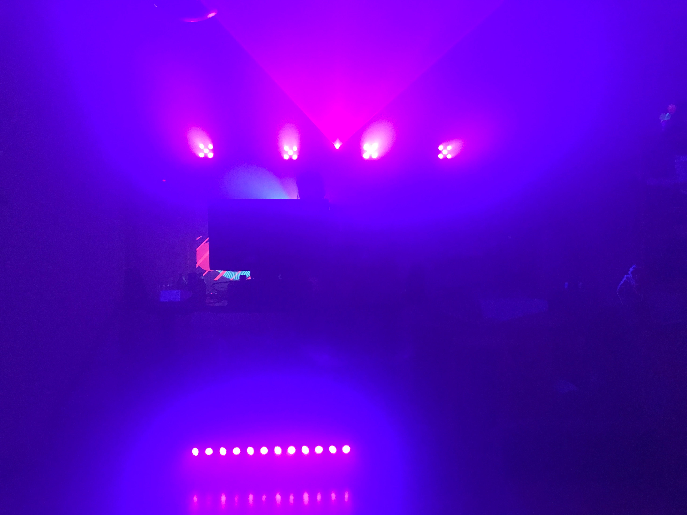
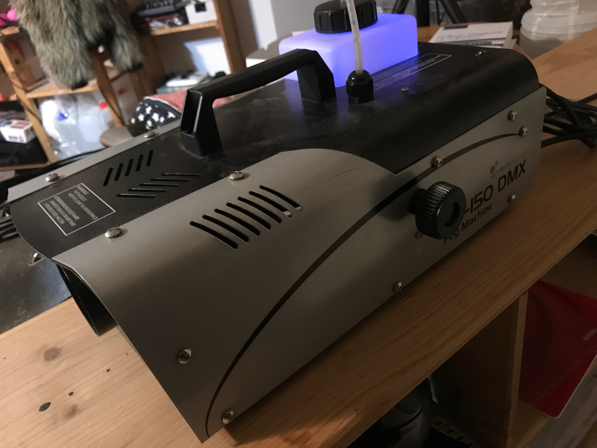
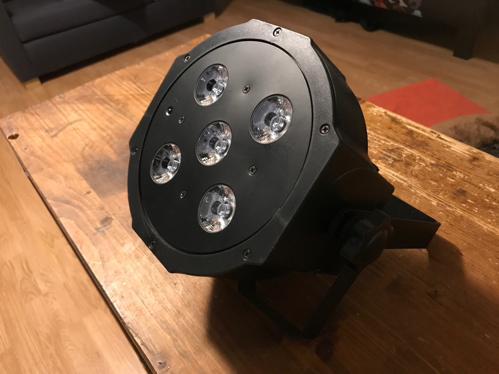
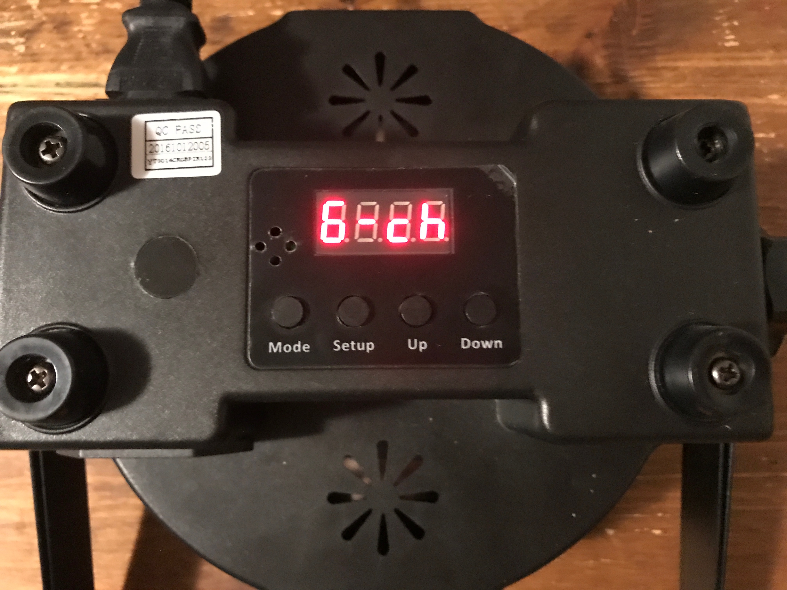

# WebUSB DMX512 Controller

TK webusb_dmx512_controller.jpg


I love to control all the lights and I always try to find new ways of doing so. Currently I'm in love with DMX512 and WebUSB.

This article describes how you can build your own DMX512 controller using an Arduino and how this controller can be used directly in the browser by leveraging WebUSB.


TK Do more references and ToC

If you already know what DMX512 is and you just want to build your device, jump to

TK Need super good pictures of lights and controller: Ask a photographer


## DMX512

[Wikipedia defines DMX512](https://en.wikipedia.org/wiki/DMX512) like this:

> DMX512 (Digital Multiplex) is a standard for digital communication networks that are commonly used to control stage lighting and effects. It was originally intended as a standardized method for controlling light dimmers, which, prior to DMX512, had employed various incompatible proprietary protocols.

DMX512 is used in many theaters, clubs and festivals to control all the lights and beyond: From static lights to moving heads and lasers to fog machines.

In my basement I have a collection of DMX512 lights:

TK: newyears_eve_2017.jpg


### How does it work?

DMX512 combines a set of lights (called fixtures) into a [bus network](https://en.wikipedia.org/wiki/Bus_network) of fixtures (called Universe). Each fixture has one ore more functionalities, such as

* RGB (Red, Green, Blue) color
* Dimmer
* UV
* Move the fixture horizontally or vertically
* Blinking effect
* Generate fog
* Blow bubbles

Each functionality can be controlled by one or more channels. This means that each fixture has a different amount of channels, depending which functionality the fixture has. It also means that you can't change the functionality of a fixture, you can only configure which of the predefined set of channels is used.

Each channel can be filled with a value between 0 and 255. In most situations it has the following meaning:

* `0 = 0%: no intensity, zero speed, no blinking position`
* `255 = 100%: full color, full speed, fast blinking`

Every fixture comes with a manual that holds all the informations you need to use the it. It includes a list all predefined channel sets + the meaning of the channel values and general information about the fixture.

#### Basic fixtures

I will describe two of my favorites fixtures to get started with DMX512.

##### Fog Machine

TK Image of fog machine


Is producing smoke to improve the visibility of the lights and the overall atmosphere.

```csv
Channel, Functionality, Description
1, Fan Speed, Regulate the speed of the fan to blow out the smoke
```

* 0 = fan is turned off
* 255 = fan is at highest speed

##### Flat PAR

TK Image of Flat PAR


Let's take a look at a very basic fixture:
The ["SePar Quad LED RGBUV IR" by Fun Generation](https://www.thomann.de/gb/fun_generation_separ_quad_led_rgb_uv_ir.htm). What does all of this mean?

* SePar = This is a [PAR light](https://en.wikipedia.org/wiki/Parabolic_aluminized_reflector_light) with 5 LEDs
* Quad LED RGBUV = The LEDs can create any RGB color and UV light at the same time
* IR = Fixture can be controlled via infrared

The [Flat PAR's manual](https://images.static-thomann.de/pics/atg/atgdata/document/manual/399604_c_399539_399604_r4_en_online.pdf) is more exciting than to the one of the Fog Machine, because the PAR has 8 channels in 4 different sets (2, 4, 6 or 8):


##### 2 Channels

```csv
Channel, Functionality, Description
1, Color or Program, Set a specific color out of a list of colors or activate a automatic show
2, Special function, Speed of the automatic show or microphone sensitivity
```

##### 4 Channels

```csv
Channel, Functionality, Description
1, Red, Intensity of Red
2, Green, Intensity of Green
3, Blue, Intensity of Blue
4, UV, Intensity of UV
```

##### 6 Channels

```csv
Channel, Functionality, Description
1, Red, Intensity of Red
2, Green, Intensity of Green
3, Blue, Intensity of Blue
4, UV, Intensity of UV
5, Dimmer, Brightness of the LEDs
6, Strobe, Blinking effect
```

##### 8 Channels

```csv
Channel, Functionality, Description
1, Red, Intensity of Red
2, Green, Intensity of Green
3, Blue, Intensity of Blue
4, UV, Intensity of UV
5, Dimmer, Brightness of the LEDs
6, Strobe, Blinking effect
7, Color or Program, Set a specific color out of a list of colors or activate a automatic show
8, Special function, Speed of the automatic show or microphone sensitivity
```

Which set of channels should you use? That depends on what you actually want to do with the fixture. In this case I want to set the RGB color and use the dimmer, so I will use the **6 channels** set.

But where can we set that? Every fixture has some kind of interface that can be used to configure it. In many cases you will find a display and some buttons:

TK flat_par_configure_channel_set_using_display.jpg



This display let's you change the configuration of the fixture, for example the set of channels that should be used.

It's also possible to set the address.

TK flat_par_configure_address_using_display.jpg


### Fixtures in a universe

The 512 in DMX512 stands for 512 channels. A combination of fixtures in a network is called a universe. Every fixture in the universe can have a specific address, so that it's possible to set the channels of a specific device in the universe.

This means that the more fixtures we have in a universe, the more channels are blocked by a fixture. That means that we should always choose a set of channels based on what we want to achieve. If we don't want to specific functionality, we choose the set that doesn't contain it.

To calculate the next free address in a universe we can do it like this: `address of fixture a + # channels of fixture a = address of fixture b`

#### Attention

This is not required, but it's always a good idea to give every fixture it's own space. Only use the same address more than once if you want to have fixtures of the same type that are in sync with each other. Because in the end they all get the same channel values if they share the same address.

### Example

Let's say we have three fixtures:

* 2 x Flat PAR with 6 channels
* 1 x Fog machine with 1 channel

The first fixture is a Flat PAR with the address of 1. Using the formula **1 + 6**, then the next fixture can start at **7**. Then we add the second Flat PAR at address **7** and the Fog Machine at address **13**.

TK Image dmx512_universe_webusb_controller.png


The next thing we need is a WebUSB DMX512 controller to send the data (= an Array of 512 values) into the universe.


## Arduino

[Wikipedia defines Arduino](https://en.wikipedia.org/wiki/Arduino) like this:

> Arduino is an open source computer hardware and software company, project, and user community that designs and manufactures single-board microcontrollers and microcontroller kits for building digital devices and interactive objects that can sense and control objects in the physical and digital world.

> The project's products are distributed as open-source hardware and software, which are licensed under the GNU Lesser General Public License (LGPL) or the GNU General Public License (GPL),[1] permitting the manufacture of Arduino boards and software distribution by anyone.

> Arduino boards are available commercially in preassembled form, or as do-it-yourself (DIY) kits.

This is the perfect foundation to create our own WebUSB DMX512 Controller, because some Arduino (like the Arduino Leonardo) have the ability to be recognized by the computer as an external USB device (for example with the ATmega32u4 chip). This makes it possible to use the Arduino over WebUSB.

KT arduino_leonardo_explained.jpg


The Arduino has a set of female headers at the top with 18 connectors and the bottom with 14 connectors. They can be used to attach all kind of electronic devices or shields to the Arduino.

An Arduino shield can extend the functionality of the Arduino by adding it on top of the headers. This makes it possible for everyone to use all kind of devices without having to know anything about electrical engineering or soldering.


### DMX512 shield

In order to control a DMX512 universe with the Arduino we use the ["2.5kV Isolated DMX512 Shield for Arduino - R2"
on tindie](https://www.tindie.com/products/Conceptinetics/25kv-isolated-dmx-512-shield-for-arduino-r2/).

Let's put it on top of the Arduino:

1. The DMX512 shield, with two DMX connectors (I and II). I is the output to send data into the universe. II is empty.
2. The Arduino Leonardo, connected over MicroUSB to the computer.

TK webusb_dmx512_controller_explained.jpg


**Attention**: As of writing this article there is no DMX512 shield for the small Arduino boards (like the Arduino Micro). This means that in order to use this shield you have to at least get an Arduino Leonardo or similar in terms of the size, because the position of the headers must be the same.

A list of Arduino(-ish) boards that can be used in combination with the shield:

* Arduino Leonardo / Arduino Leonardo ETH
* Seeeduino Lite


TK Separator

The hardware is ready, so let's jump into the software.


### Install software

We have to install some basic software in order to push code onto the Arduino:

* Install the [Arduino IDE](https://www.arduino.cc/en/Main/Software)
*


### Arduino IDE

Arduino has it's own software to write and compile code. It's called Arduino IDE and


### Arduino Libraries
Install the libraries from arduino/libraries into the Arduino library folder

Then upgrade the Arduino IDE from USB 2.0 to 2.1: Go into the installation directory of your Arduino IDE and open hardware/arduino/avr/cores/arduino/USBCore.h. Then find the line #define USB_VERSION 0x200 and change 0x200 to 0x210. (@see Step 3)


### WebUSB DMX512 Controller Sketch

```arduino
#include <WebUSB.h>
#include <Conceptinetics.h>

WebUSB WebUSBSerial(1, "localhost:1337");
#define Serial WebUSBSerial

// Amount of DMX channels
#define channels 512

// dmx_master(channels , pin);
// channels: Amount of DMX channels
// pin: Pin to do read / write operations on the DMX shield
DMX_Master dmx_master(channels, 2);

// Amount of incoming bytes via WebUSB
byte incoming[channels];

// Run once on startup
void setup() {
  // Initialize incoming with 0
  memset(incoming, 0, sizeof(incoming));

  // Wait until WebUSB connection is established
  while (!Serial) {
    ;
  }

  // Start DMXMaster & transmission to DMXShield
  dmx_master.enable();
}

// Run over and over again
void loop() {
  // WebUSB is available
  if (Serial.available() > 0) {

    // Read bytes (the # channels) from WebUSB and save them into incoming
    Serial.readBytes(incoming, channels);

    // Iterate over all channels
    for (int i = 0; i < channels; i++) {
      // Set the value for each channel
      dmx_master.setChannelValue(i + 1, incoming[i]);
    }
  }
}
```


## WebUSB

* https only website
* URL whitelisting in the USB device

### USB in a very tiny nutshell

If you want to read super good introduction to make sense to the USB standard, then I recommend [USB in a nutshell](http://www.beyondlogic.org/usbnutshell/usb1.shtml).

#### USB Descriptors

TK usb_descriptors.png


https://wicg.github.io/webusb/#appendix-descriptors

USB devices identify themselves to the host by providing a set of binary structures known as descriptors. The first one read by the host is the device descriptor which contains basic information such as the vendor and product IDs assigned by the USB-IF and the manufacturer.


## Using everything together

### Arduino + WebUSB


## What now?

### Further information

* [WebUSB Spec](https://wicg.github.io/webusb/)
* [Access USB devices on the Web](https://developers.google.com/web/updates/2016/03/access-usb-devices-on-the-web)
* [WebUSB demos running on Arduino](https://github.com/webusb/arduino)
* [WebUSB <3 Arduino](http://slides.com/andreastagi/webusbarduino)
* [Web enabling legacy devices](https://medium.com/@larsgk/web-enabling-legacy-devices-dc3ecb9400ed)
* [Programm a smart device directly, no install needed](https://medium.com/@kennethrohde/program-a-smart-device-directly-no-install-needed-cd8b29320d76)

### luminave

### fivetwelve
