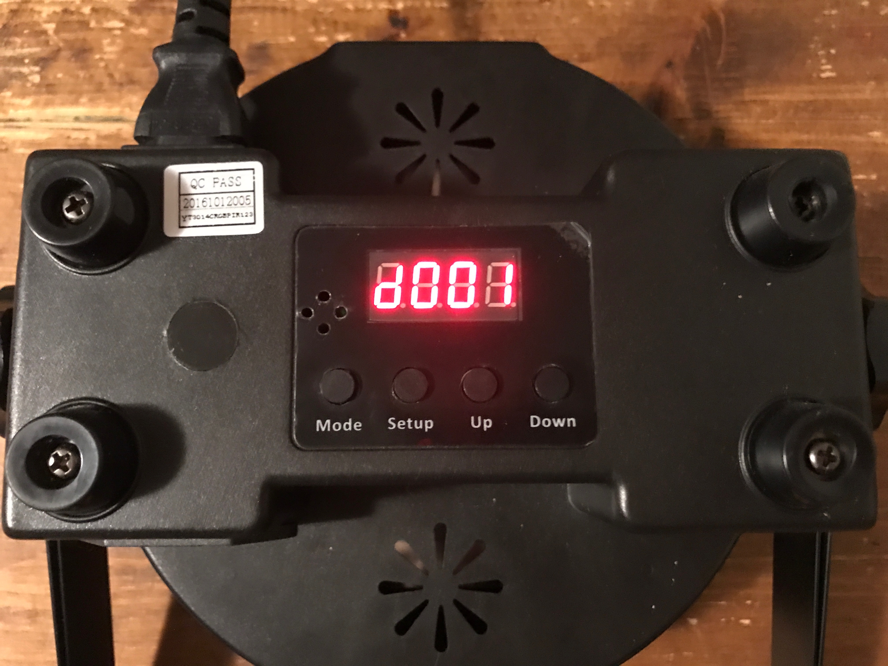
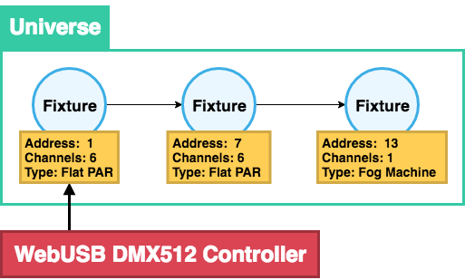
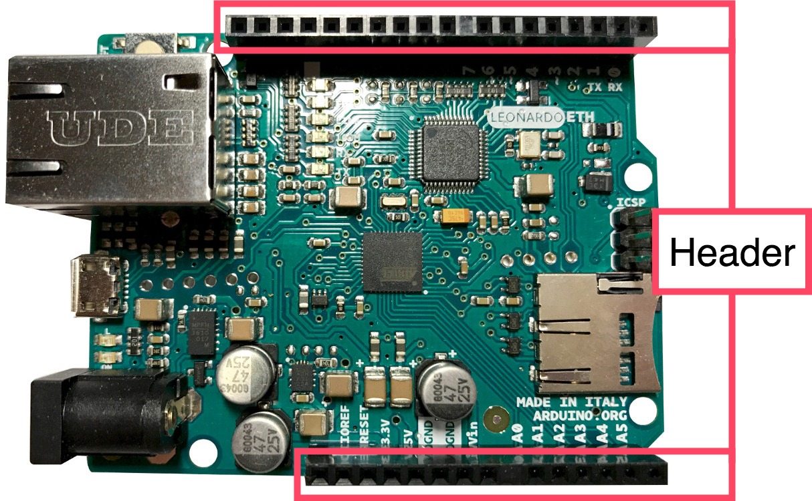
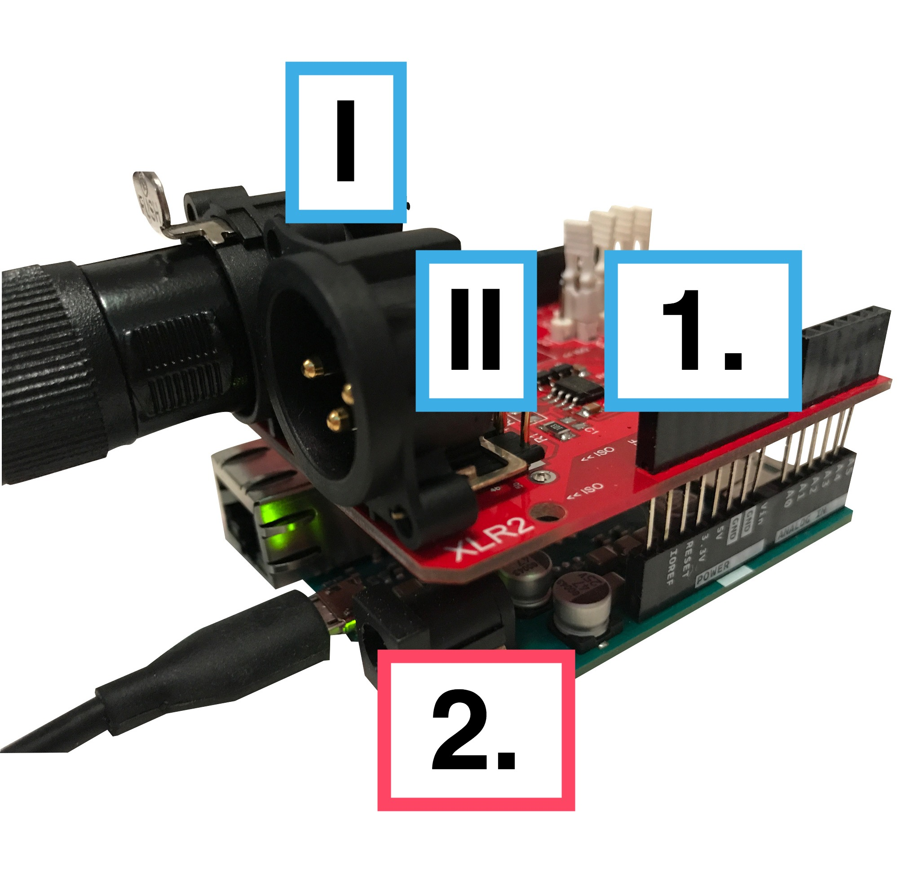
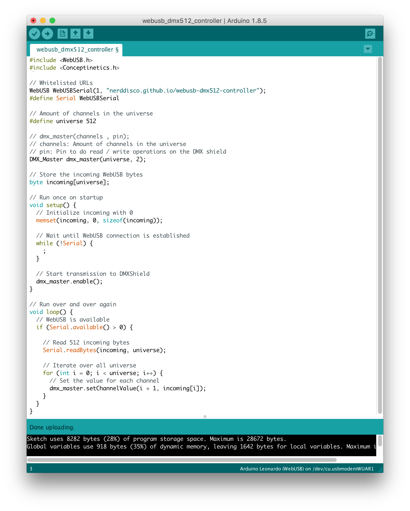
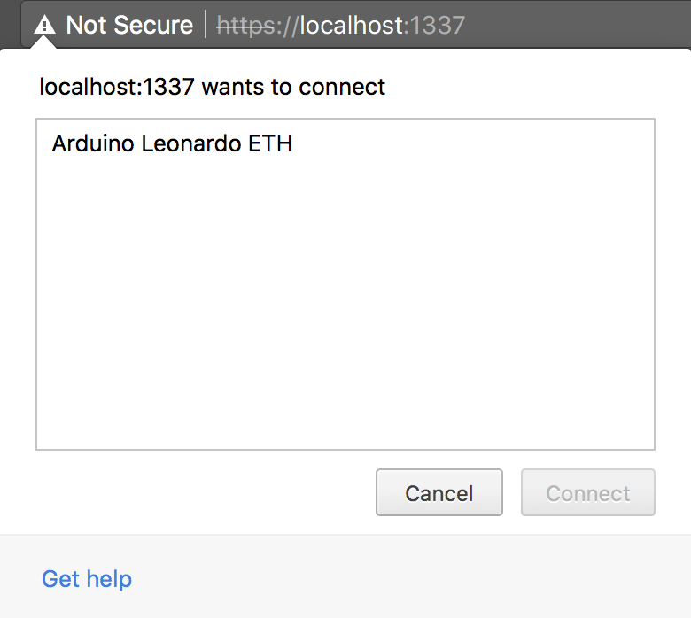
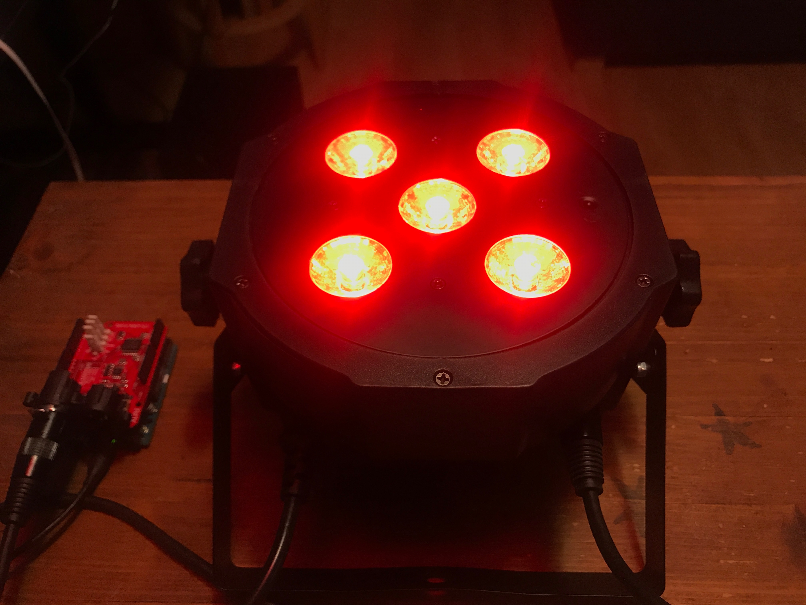
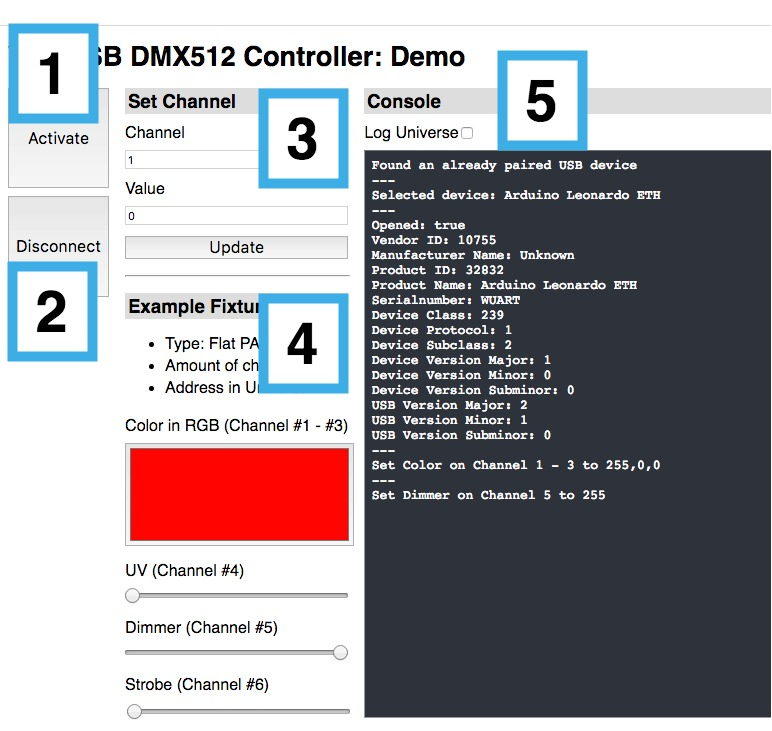

# WebUSB DMX512 Controller

TK webusb_dmx512_controller.jpg


I love to control all the lights and I always try to find new ways of doing so. Currently I'm in love with DMX512 and WebUSB.

This article describes how you can build your own DMX512 controller using an Arduino and how this controller can be used directly in the browser by leveraging WebUSB.


TK Do more references and ToC

If you already know what DMX512 is and you just want to build your device, jump to


## DMX512

[Wikipedia defines DMX512](https://en.wikipedia.org/wiki/DMX512) like this:

> DMX512 (Digital Multiplex) is a standard for digital communication networks that are commonly used to control stage lighting and effects. It was originally intended as a standardized method for controlling light dimmers, which, prior to DMX512, had employed various incompatible proprietary protocols.

DMX512 is used in many theaters, clubs and festivals to control all the lights and beyond: From static lights to moving heads and lasers to fog machines.

In my basement I have a collection of DMX512 lights:

TK: newyears_eve_2017.jpg


### How does it work?

DMX512 combines a set of lights (called fixtures) into a [bus network](https://en.wikipedia.org/wiki/Bus_network) of fixtures (called Universe). Each fixture has one or more functionalities, such as

* Color in [RGB (Red, Green, Blue)](https://en.wikipedia.org/wiki/RGB_color_model)
* Dimmer
* UV
* Movement (horizontally or vertically)
* Blinking effect
* Generate fog
* Blow bubbles

Each functionality can be controlled by one or more channels. This means that each fixture has a different amount of channels, depending which functionality the fixture has. It also means that you can't change the functionality of a fixture, you can only configure which of the predefined set of channels is used.

Each channel can be filled with a value between 0 and 255. In most situations it has the following meaning:

* `0 = 0%: no intensity, zero speed, no blinking`
* `255 = 100%: full color, full speed, fast blinking`

Every fixture comes with a manual that holds all the informations you need to use the it. It includes a list all predefined channel sets + the meaning of the channel values and general information about the fixture.

#### Basic fixtures

I will describe two of my favorites fixtures to get started with DMX512.

##### Fog Machine

TK Image of fog machine


Is producing smoke to improve the visibility of the lights and the overall atmosphere.

```csv
Channel, Functionality, Description
1, Fan Speed, Regulate the speed of the fan to blow out the smoke
```

* 0 = fan is turned off
* 255 = fan is at highest speed

##### Flat PAR

TK Image of Flat PAR


Let's take a look at a very basic fixture:
The ["SePar Quad LED RGBUV IR" by Fun Generation](https://www.thomann.de/gb/fun_generation_separ_quad_led_rgb_uv_ir.htm). What does all of this mean?

* SePar = This is a [PAR light](https://en.wikipedia.org/wiki/Parabolic_aluminized_reflector_light) with 5 LEDs
* Quad LED RGBUV = The LEDs can create any RGB color and UV light at the same time
* IR = Fixture can be controlled via infrared

The [Flat PAR's manual](https://images.static-thomann.de/pics/atg/atgdata/document/manual/399604_c_399539_399604_r4_en_online.pdf) is more exciting than to the one of the Fog Machine, because the PAR has 8 channels in 4 different sets (2, 4, 6 or 8):


##### 2 Channels

```csv
Channel, Functionality, Description
1, Color or Program, Set a specific color out of a list of colors or activate a automatic show
2, Special function, Speed of the automatic show or microphone sensitivity
```

##### 4 Channels

```csv
Channel, Functionality, Description
1, Red, Intensity of Red
2, Green, Intensity of Green
3, Blue, Intensity of Blue
4, UV, Intensity of UV
```

##### 6 Channels

```csv
Channel, Functionality, Description
1, Red, Intensity of Red
2, Green, Intensity of Green
3, Blue, Intensity of Blue
4, UV, Intensity of UV
5, Dimmer, Brightness of the LEDs
6, Strobe, Blinking effect
```

##### 8 Channels

```csv
Channel, Functionality, Description
1, Red, Intensity of Red
2, Green, Intensity of Green
3, Blue, Intensity of Blue
4, UV, Intensity of UV
5, Dimmer, Brightness of the LEDs
6, Strobe, Blinking effect
7, Color or Program, Set a specific color out of a list of colors or activate a automatic show
8, Special function, Speed of the automatic show or microphone sensitivity
```

Which set of channels should you use? That depends on what you actually want to do with the fixture. In this case I want to set the RGB color and use the dimmer, so I will use the **6 channels** set.

But where can we set that? Every fixture has some kind of interface that can be used to configure it. In many cases you will find a display and some buttons:

TK flat_par_configure_channel_set_using_display.jpg


This display let's you change the configuration of the fixture, for example the set of channels that should be used.

It's also possible to set the address.

TK flat_par_configure_address_using_display.jpg


### Fixtures in a universe

The 512 in DMX512 stands for 512 channels. A combination of fixtures in a network is called a universe. Every fixture in the universe can have a specific address, so that it's possible to set the channels of a specific device in the universe.

This means that the more fixtures we have in a universe, the more channels are blocked by a fixture. That means that we should always choose a set of channels based on what we want to achieve. If we don't want to specific functionality, we choose the set that doesn't contain it.

To calculate the next free address in a universe we can do it like this: `address of fixture a + # channels of fixture a = address of fixture b`

**Attention**: This is not required, but it's always a good idea to give every fixture it's own space. Only use the same address more than once if you want to have fixtures of the same type that are in sync with each other. Because in the end they all get the same channel values if they share the same address.

### Example

Let's say we have three fixtures:

* 2 x Flat PAR with 6 channels
* 1 x Fog machine with 1 channel

The first fixture is a Flat PAR with the address of 1. Using the formula **1 + 6**, then the next fixture can start at **7**. Then we add the second Flat PAR at address **7** and the Fog Machine at address **13**.

TK Image dmx512_universe_webusb_controller.png


The next thing we need is a WebUSB DMX512 controller to send the data (= an Array of 512 values) into the universe.

TK Separator

---


## Arduino

[Wikipedia defines Arduino](https://en.wikipedia.org/wiki/Arduino) like this:

> Arduino is an open source computer hardware and software company, project, and user community that designs and manufactures single-board microcontrollers and microcontroller kits for building digital devices and interactive objects that can sense and control objects in the physical and digital world.

> The project's products are distributed as open-source hardware and software, which are licensed under the GNU Lesser General Public License (LGPL) or the GNU General Public License (GPL),[1] permitting the manufacture of Arduino boards and software distribution by anyone.

> Arduino boards are available commercially in preassembled form, or as do-it-yourself (DIY) kits.

This is the perfect foundation to create our own WebUSB DMX512 Controller, because some Arduino (like the Arduino Leonardo) have the ability to be recognized by the computer as an external USB device (for example with the ATmega32u4 chip). This makes it possible to use the Arduino over WebUSB.

KT arduino_leonardo_explained.jpg


The Arduino has a set of female headers at the top with 18 connectors and the bottom with 14 connectors. They can be used to attach all kind of electronic devices or shields to the Arduino.

An Arduino shield can extend the functionality of the Arduino by adding it on top of the headers. This makes it possible for everyone to use all kind of devices without having to know anything about electrical engineering or soldering.


### Arduino DMX512 shield

In order to control a DMX512 universe with the Arduino we use the ["2.5kV Isolated DMX512 Shield for Arduino - R2"
on tindie](https://www.tindie.com/products/Conceptinetics/25kv-isolated-dmx-512-shield-for-arduino-r2/).

Let's put it on top of the Arduino:

1. The DMX512 shield, with two DMX connectors (I and II). I is the output to send data into the universe. II is empty.
2. The Arduino Leonardo, connected over MicroUSB to the computer.

TK webusb_dmx512_controller_explained.jpg


**Attention**: As of writing this article there is no DMX512 shield for the small Arduino boards (like the Arduino Micro). This means that in order to use this shield you have to at least get an Arduino Leonardo or similar in terms of the size, because the position of the headers must be the same.

A list of boards that can be used in combination with the shield:

* Arduino Leonardo / Arduino Leonardo ETH
* Seeeduino Lite

The hardware is ready, so let's jump into the software.


TK Separator

---


### Setup

In order to be able to upload the code to the Arduino you have to setup the following stuff:

1. Checkout the [NERDDISCO/webusb-dmx512-controller](https://github.com/NERDDISCO/webusb-dmx512-controller) repository to your computer
  ```bash
  git clone git@github.com:NERDDISCO/webusb-dmx512-controller.git
  ```
2. Install [npm](https://www.npmjs.com) dependencies
  ```bash
  # go into directory of repository
  cd webusb-dmx512-controller

  # install dependencies
  npm install
  ```
3. Download & install the [Arduino IDE](https://www.arduino.cc/en/Main/Software#download) >= 1.8.5, so you are able to write & push code onto the Arduino
4. Open the Arduino IDE
5. Open the preferences: *Arduino > Preferences*
6. In the preferences dialog you have to change the *Sketchbook location* so that it points to the *sketchbook* folder that comes with the repository:

  
7. Close the Arduino IDE and then open it again (this is needed to load the new sketchbook that we selected in the step before)
8. Now we need to configure the Arduino IDE so that it can recognize our Arduino Leonardo:
   1. Select the model: *Tools > Board > Arduino Leonardo (WebUSB)*
   2. Select the USB port: *Tools > Port > /dev/tty.usbmodem* (This should be something with *usb* in the name and can be different on your computer)

    **Attention**: This can only be selected if your Arduino is actually attached to your computer!
9. Open the sketch (if it's not already open): *File > Sketchbook > webusb_dmx512_controller*
10. Verify that the sketch is working: *Sketch > Verify/Compile*. This will produce an output like this:
  ```bash
  Sketch uses 8258 bytes (28%) of program storage space. Maximum is 28672 bytes.
  Global variables use 888 bytes (34%) of dynamic memory, leaving 1672 bytes for local variables. Maximum is 2560 bytes.
```
11. Upload the sketch to the Arduino: *Sketch > Upload* This will produce a similar output as step 10.

**Attention**: If the steps 10 or 11 did not work as promised, [please open an issue on GitHub in my repository](https://github.com/NERDDISCO/webusb-dmx512-controller/issues)

When you are done your Arduino IDE should look like this:




### Arduino Sketch

The applications that you upload on the Arduino are called sketch. They contain all the code and external libraries that are needed in order to control what the Arduino should do for you.

You can "split" the sketch itself into three different parts, so let's see what is happening in each of them.

#### 1. Imports & definitions & global variables

```arduino
// (a)
#include <WebUSB.h>
#include <Conceptinetics.h>

// (b) URL whitelisting
WebUSB WebUSBSerial(1, "nerddisco.github.io/webusb-dmx512-controller");
// (c)
#define Serial WebUSBSerial

// (d) Amount of channels in the universe
#define universe 512

// (e) dmx_master(channels , pin);
// channels: Amount of channels in the universe
// pin: Pin to do read / write operations on the DMX shield
DMX_Master dmx_master(universe, 2);

// (f) Store the incoming WebUSB bytes
byte incoming[universe];
```

**(a)** Import the external libraries that are needed:

* [WebUSB](https://github.com/webusb/arduino) to handle the WebUSB connection
* [Conceptinetics](https://sourceforge.net/projects/dmxlibraryforar/) to handle the DMX512 shield (which is maintained by the same person that is selling the shield)

Those two libraries are already part of the [sketchbook](https://github.com/NERDDISCO/webusb-dmx512-controller/tree/master/sketchbook) that came with the repository.

**(b)** For security reasons the WebUSB device has to whitelist the URLs that are allowed to use the device in the browser. In this case it points to my demo page

**(c)** Use `Serial` instead of `WebUSBSerial`

**(d)** Set the amount of channels in the universe to 512

**(e)** Initialize the dmx_master which is used to send data to the DMX512 shield

**(f)** Create an array of bytes that has the size of 512 to save the data that is coming over WebUSB to the Arduino

#### 2. setup()

```arduino
// (a) Run once on startup
void setup() {
  // (b) Initialize incoming with 0
  memset(incoming, 0, sizeof(incoming));

  // (c) Wait until WebUSB connection is established
  while (!Serial) {
    ;
  }

  // (d) Start transmission to DMX-Shield
  dmx_master.enable();
}
```

**(a)** Every time the Arduino is started (for example when you connect it over USB to your computer), the `setup()` function is triggered once. It can be used to initialize everything.

**(b)** Fill the `incoming` array of bytes with 0, so that every channel in the universe has a default value. This is needed to put the universe in a clean state.

**(c)** Wait until the WebUB connection in the browser was successfully established with the Arduino

**(d)** When *(c)* is fulfilled, start the communication with the DMX512 shield


#### 3. loop()

```arduino
// (a) Run over and over again
void loop() {
  // (b) WebUSB is available
  if (Serial.available() > 0) {

    // (c) Read 512 incoming bytes
    Serial.readBytes(incoming, universe);

    // (d) Iterate over all universe
    for (int i = 0; i < universe; i++) {

      // (e) Set the value for each channel
      dmx_master.setChannelValue(i + 1, incoming[i]);
    }
  }
}
```

**(a)** The main logic of the code is happening in loop, because this function is called over and over again (and not only once as `setup()` does)

**(b)** When the WebUSB connection in the browser was successfully established with the Arduino

**(c)** Read 512 bytes that are send via WebUSB to the Arduino and save them into `incoming`

**(d)** Iterate over all 512 values

**(e)** Set the value of each channel of the universe according to the data that was received over WebUSB. First channel is 1.


TK Separator

---


## WebUSB

[Wikipedia defines USB](https://en.wikipedia.org/wiki/USB) like this:

> USB, short for Universal Serial Bus, is an industry standard that was developed to define cables, connectors and protocols for connection, communication, and power supply between personal computers and their peripheral devices.

USB gives us the power to use devices regardless of the OS. Well, that is not entirely true, because only devices with standard functionality (= keyboard, mice, audio, video and storage devices) can be used everywhere. Non-standard devices always need some kind of OS-specific driver or SDK from the hardware manufacturer. This makes it super hard for developers to actually use these USB devices on the web.

WebUSB is here to overcome this problem, as it provides a safe way to expose non-standard USB devices in the browser. But what does safe even mean? The WebUSB standard defines different kind of protections:

1. You can use it locally on localhost for testing
2. You can use it online only secured via https
3. You need a device that can handle URL whitelisting, meaning that the device has to allow on which URLs it can be used (which we already saw in the Arduino Sketch)
4. The user has to allow using the USB device by triggering an explicit gesture (for example a click)

As of right now you can use WebUSB in Google Chrome 63 (native support) and as a [port in Node.js](https://github.com/thegecko/webusb). This might change in the future, so [let's keep track on the implementation status](https://github.com/WICG/webusb#implementation-status).

### Using the DMX512 controller

At this point you already have the hardware ready, but to actually make use of it in the browser I created a module. It is part of the [NERDDISCO/webusb-dmx512-controller](https://github.com/NERDDISCO/webusb-dmx512-controller) repository and you can find it in [controller.js](https://github.com/NERDDISCO/webusb-dmx512-controller/blob/master/controller.js). The module itself is also [published on npm](https://www.npmjs.com/package/webusb-dmx512-controller), so you can install it into your project: `npm install webusb-dmx512-controller`


### Create a connection to the Arduino

```javascript
// (a) Import the module
import Controller from 'webusb-dmx512-controller/controller.js'

// (b) Create an instance
const controller = new Controller()

// (c) Get a reference to the button
const activateButton = document.getElementById('activateWebUsb')

// (d) Listen for click events on the button
activateButton.addEventListener('click', e => {

  // (e) Enable WebUSB and select the Arduino
  controller.enable().then(() => {

    // (f) Create a connection to the selected Arduino
    controller.connect()
  })

})
```

**(a)** Import the ES6 module

**(b)** Create an instance of the module

**(c)** Get a reference to the button (or any other element the user can interact with to trigger the user gesture required by WebUSB protection mentioned earlier)

**(d)** Listen for click events on the button (which have to be triggered by the user)

**(e)** This will enable WebUSB and open a dialog for the user in which they can select the Arduino. The dialog looks like this (Chrome on macOS):


**(f)** We can create a connection to the Arduino when *(e)* was successful


### Update the DMX512 universe

Now that we have a connection to the Arduino from the browser, we can update the universe by using a single function:

```javascript
controller.updateUniverse(channel, value)
```

* The first parameter is the `channel` and expects a `number`
* The second parameter is the `value` and expects either a `number` or an `array` of numbers

The function itself has two "modes":

1. *Single* = Update one `channel`. This happens when the `value` is a `number`
2. *Multiple* = Update multiple channels starting at `channel`. This happens when `value` is an `array`

Before we start to use the function, let's recapture what we have in our DMX512 universe:

**(I)** Flat PAR with 6 channels at address 1

**(II)** Flat PAR with 6 channels at address 7

**(III)** Smoke machine with 1 channel at address 13

Let's assume we want to set the *Color* (= channels 1, 2 & 3) to red for **(I)**:

```javascript
// Set each channel separately (mode = single)
controller.updateUniverse(1, 255)
controller.updateUniverse(2, 0)
controller.updateUniverse(3, 0)

// Or set all 3 channels at once (mode = multiple)
controller.updateUniverse(1, [255, 0, 0])
```

Yaaaay, our **(I)** is now in red. Or isn't it? Well no, setting the *Color* alone is not enough. You also have to set the *Dimmer* on channel 5, because that controls how bright the LEDs are. Initially all channels are set to 0, which means that the brightness is "turned off". So let's set the *Dimmer* to 255:

```javascript
// Set the dimmer to it's maximum
controller.updateUniverse(5, 255)
```

Now the fixture **(I)** is shining in bright red.

TK flat_par_color_red_dimmer_255.jpg



Let's also set the color of fixture **(II)** (address: 7) to yellow and use a slow strobe (= blinking at low frequency):

```javascript
// Set color of fixture II to yellow
controller.updateUniverse(7, [255, 255, 0])

// Set dimmer of fixture II to half brightness
controller.updateUniverse(11, 127)

// Use a slow strobe for fixture II
controller.updateUniverse(12, 8)
```

To improve the lighting effect of the other two fixtures, we also activate the smoke of fixture **(III)** (address 13):

```javascript
// Activate smoke of fixture III
controller.updateUniverse(13, 255)
```


### How does updateUniverse() work?

Every time you use the `updateUniverse()` function, the `controller.universe` array gets updated with the specified value(s), converted to an [Uint8Array](https://developer.mozilla.org/en-US/docs/Web/JavaScript/Reference/Global_Objects/Uint8Array) and finally send to the Arduino. The array itself looks like this (after we called it several times above):


```javascript
console.log(controller.universe)

[255, 0, 0, 0, 255, 0, 255, 255, 0, 0, 125, 0, 255, 0, 0, 0, 0, 0, 0, 0, 0, 0, 0, 0, 0, 0, 0, 0, 0, 0, 0, 0, 0, 0, 0, 0, 0, 0, 0, 0, 0, 0, 0, 0, 0, 0, 0, 0, 0, 0, 0, 0, 0, 0, 0, 0, 0, 0, 0, 0, 0, 0, 0, 0, 0, 0, 0, 0, 0, 0, 0, 0, 0, 0, 0, 0, 0, 0, 0, 0, 0, 0, 0, 0, 0, 0, 0, 0, 0, 0, 0, 0, 0, 0, 0, 0, 0, 0, 0, 0, 0, 0, 0, 0, 0, 0, 0, 0, 0, 0, 0, 0, 0, 0, 0, 0, 0, 0, 0, 0, 0, 0, 0, 0, 0, 0, 0, 0, 0, 0, 0, 0, 0, 0, 0, 0, 0, 0, 0, 0, 0, 0, 0, 0, 0, 0, 0, 0, 0, 0, 0, 0, 0, 0, 0, 0, 0, 0, 0, 0, 0, 0, 0, 0, 0, 0, 0, 0, 0, 0, 0, 0, 0, 0, 0, 0, 0, 0, 0, 0, 0, 0, 0, 0, 0, 0, 0, 0, 0, 0, 0, 0, 0, 0, 0, 0, 0, 0, 0, 0, 0, 0, 0, 0, 0, 0, 0, 0, 0, 0, 0, 0, 0, 0, 0, 0, 0, 0, 0, 0, 0, 0, 0, 0, 0, 0, 0, 0, 0, 0, 0, 0, 0, 0, 0, 0, 0, 0, 0, 0, 0, 0, 0, 0, 0, 0, 0, 0, 0, 0, 0, 0, 0, 0, 0, 0, 0, 0, 0, 0, 0, 0, 0, 0, 0, 0, 0, 0, 0, 0, 0, 0, 0, 0, 0, 0, 0, 0, 0, 0, 0, 0, 0, 0, 0, 0, 0, 0, 0, 0, 0, 0, 0, 0, 0, 0, 0, 0, 0, 0, 0, 0, 0, 0, 0, 0, 0, 0, 0, 0, 0, 0, 0, 0, 0, 0, 0, 0, 0, 0, 0, 0, 0, 0, 0, 0, 0, 0, 0, 0, 0, 0, 0, 0, 0, 0, 0, 0, 0, 0, 0, 0, 0, 0, 0, 0, 0, 0, 0, 0, 0, 0, 0, 0, 0, 0, 0, 0, 0, 0, 0, 0, 0, 0, 0, 0, 0, 0, 0, 0, 0, 0, 0, 0, 0, 0, 0, 0, 0, 0, 0, 0, 0, 0, 0, 0, 0, 0, 0, 0, 0, 0, 0, 0, 0, 0, 0, 0, 0, 0, 0, 0, 0, 0, 0, 0, 0, 0, 0, 0, 0, 0, 0, 0, 0, 0, 0, 0, 0, 0, 0, 0, 0, 0, 0, 0, 0, 0, 0, 0, 0, 0, 0, 0, 0, 0, 0, 0, 0, 0, 0, 0, 0, 0, 0, 0, 0, 0, 0, 0, 0, 0, 0, 0, 0, 0, 0, 0, 0, 0, 0, 0, 0, 0, 0, 0, 0, 0, 0, 0, 0, 0, 0, 0, 0, 0, 0, 0, 0, 0, 0, 0, 0, 0, 0, 0, 0, 0, 0, 0, 0, 0, 0, 0, 0, 0, 0, 0, 0, 0, 0, 0, 0, 0, 0, 0, 0, 0, 0, 0, 0, 0]
```


TK separator

---

## Live Demo

In order to test the WebUSB DMX512 Controller directly in the browser, I have [created a demo](https://nerddisco.github.io/webusb-dmx512-controller) that is using the [webusb-dmx512-controller](https://www.npmjs.com/package/webusb-dmx512-controller) module and wraps it in a basic UI:

1. Activate WebUSB (& select the Arduino)
2. Disconnect from the Arduino
3. Set the value (0 - 255) of any channel (1 - 512) in the universe
4. Use the example fixture (Flat PAR with 6 channels) from above and set the Color in RGB, UV, Dimmer and Strobe
5. Console to show what is happening behind the scenes. It's also possible to print out the content of the universe when using the "log universe" checkbox

TK webusb_dmx512_controller_demo_explained.jpg




TK Separator

---


## What now?

### luminave
JO JO

### fivetwelve
FIVE TWELVE


---

## Resources

* [WebUSB Spec](https://wicg.github.io/webusb/)
* [Access USB devices on the Web](https://developers.google.com/web/updates/2016/03/access-usb-devices-on-the-web)
* [WebUSB demos running on Arduino](https://github.com/webusb/arduino)
* [WebUSB <3 Arduino](http://slides.com/andreastagi/webusbarduino)
* [Web enabling legacy devices](https://medium.com/@larsgk/web-enabling-legacy-devices-dc3ecb9400ed)
* [Programm a smart device directly, no install needed](https://medium.com/@kennethrohde/program-a-smart-device-directly-no-install-needed-cd8b29320d76)
* [Universal Serial Bus Class Definitions for Communication Devices](https://cscott.net/usb_dev/data/devclass/usbcdc10.pdf)
* [USB in a nutshell](http://www.beyondlogic.org/usbnutshell/usb1.shtml)
* [USB in a nutshell: Super good introduction to the USB standard](http://www.beyondlogic.org/usbnutshell/usb1.shtml)
* [USB made simple](http://www.usbmadesimple.co.uk)
